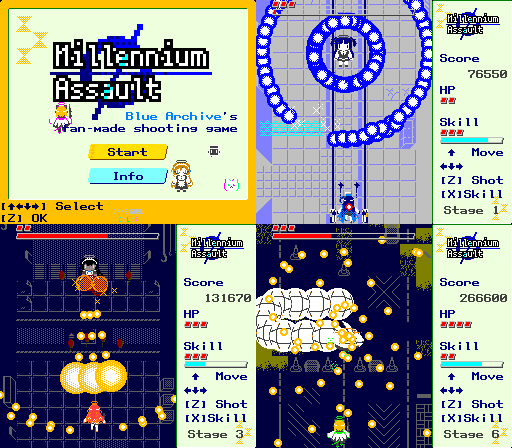

# MillenniumAssault
ブルアカ二次創作 STG (リリース用リポジトリ)

https://andanteyk.github.io/MillenniumAssault



## Description

縦スクロール風シューティングゲームです。

* 方向キー : 移動
* Z キー : 決定 / ショット
* X キー : スキル発動（いわゆる「ボム」です。回数制限は敵を攻撃すると回復）

## Notice

この作品は「ブルーアーカイブ」の二次創作です。

https://bluearchive.jp/

## Information
> (ゲーム内説明書のコピー)

```
About
--------
[ブルーアーカイブ] のキャラクターを そうさして
たたかう たてスクロール シューティングゲームです。

(マウススクロールで かいてきによめます)


Control
--------
そうさは キーボードを つかいます。

[↑←↓→] (やじるしキー) いどう

[Z] ショット / メニュー けってい
 てきをこうげきします。 むげんにうてます

* ショットを うっている あいだは、
ひだんはんていの めやすの まるが でます

* ショットを うたないと、
すこしはやく いどうできます

[X] スキル
 てきの たま をけせる スキルをうちます
 はつどうちゅうは むてきです
 ただし かいすうせいげんが あります

* ショットをあてて たおすと ゲージがたまり、
 まんたんになると 1 かい つかえます


(ゲームパッドや モバイルでも いちおう
 そうさできるように したつもりですが、
 どうさの ほしょうは できません ...
 
 ゲームパッドでは、
 [けってい] ボタンが ショット、
 [キャンセル] ボタンが スキルです
 
 モバイルでは、みぎしたの スティックを
 うごかして いどうします
 ショットは みぎうえのボタンで on/off
 スキルは ボタンをおすと はつどうします)


Players
--------
* モモイ *
ようきな ふたごの あね
ひろがる ワイドショット
スキルは こうはんいに たまをばらまく

* ミドリ *
うちきな ふたごの いもうと
じどうで てきをねらう スナイプショット
たまがこうそくで あてやすい

* アリス *
ゲームがすきな しんぴしょうじょ
レーザーは てき・バリアを かんつうする
スキルは きょだいな レールガン

* ユズ *
ゲームかいはつぶの ぶちょう
ばくはつする グレネードをうつ
スキルは めんせいあつ ミサイル


Enemies
--------
ミレニアムの せいとたちと たたかいます。
HP が なくなるまえに ステージ 6 を
とっぱできれば クリアです。

* ユウカ *
せいとかい の かいけい
バリアは どちらのこうげきも はじく

* アカネ *
C&C の そうじのめいじん
かべにあたると はんしゃする こうげきが とくい

* カリン *
C&C の しんちょうな スナイパー
はやくてきょだいな たまをはなつ

* アスナ *
C&C の つかみどころのない エージェント
さきがよめない こうげきをする

* ネル *
C&C の おこりっぽい リーダー
SMG で そうしゃこうげきする

* ビナー *
とつぜんあらわれた きょだいなかいぶつ
たおしてしまった C&C のかわりに
たたかうことになった


Items
--------
ボスは ときどき アイテムをおとします

あかいハート HP がふえます (さいだい 8)
あおいとけい スキルがふえます


Tips
--------
* スキルゲージは
100000 スコアで たまります

* うちこみスコアは
あたえたダメージと おなじです
てきをたおすと さいだい HP のぶん 
スコアがふえます

* ステージクリアで 
1000000 スコアがふえます

* クリアしたときの ボーナススコア
 HP  x500000
 スキル x100000

* ひだんしても すぐに [X] で スキル を
うてば ダメージを なかったことにできます
 (にゅうりょくゆうよ 0.25 s)

* ひだんしたとき スキルがすくないと
 2 かいぶん もらえます

* いりょく いちらん

* モモイ *
メイン 100dmg/0.25s*2way
サブ   50dmg/0.25s*4way
スキル 100dmg/0.1s*30

* ミドリ *
メイン 100dmg/0.25s*2way
サブ  100dmg/0.5s*2way
スキル 100dmg/0.2s*15

* アリス *
メイン 100dmg/0.25s*2way
サブ   50dmg/0.25s*2way
スキル 100dmg/0.25s

* ユズ *
メイン  80dmg/0.25s*2way
サブ   50dmg/0.5s*2way
(ばくはつ 10dmg/0.2s*2)
スキル 400dmg/0.25s*12
(ばくはつ 200dmg/0.25s*4)


Special
--------
* [F8] キーで 
こうそくしゅうかい できます

* [F5] キーで
タイトルに もどれます?

* Player Select で
 [↑↑↓↓←→←→XZ]
すると デバッグモード になります
　(せいこうすると おとがなります)

むてきで スキルも うちほうだい
ですが スコアが アビドスじょうたいに なります

ユズいがいに したいときは
さいごの [Z] をおすまえに
カーソルを うごかしてください

* [123456] キーを おしながら 
Player Select すると
たいおうする ステージから はじまります
 (qwerty の うえのキーです。
  テンキーでは うごきません)
```


